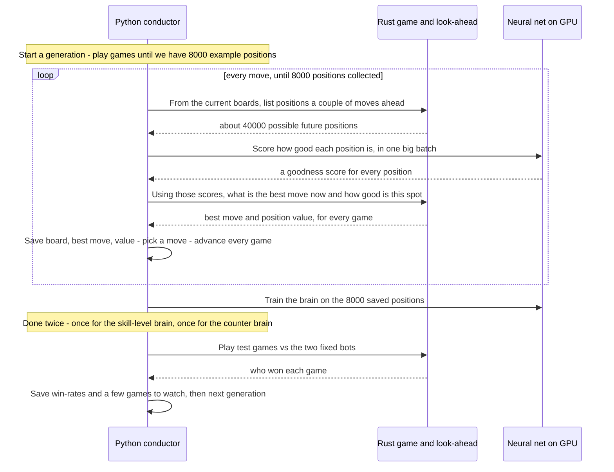
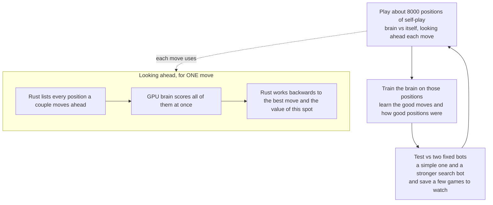

# How the training works (plain version)

We're teaching a neural network to play snake by having it **play games against
itself over and over, then learn from those games.** Repeat forever; it slowly
gets better.

A few ideas in plain words:
- **The brain** = the neural network. Given a board, it outputs *how good this
  position looks* (a score) and *what move it likes*.
- **Looking ahead** = before each move we don't just trust the brain blindly. We
  list out the positions that could happen a couple of moves from now, ask the
  brain to score all of them, then work backwards to pick the best move. This is
  a small search, and it's what makes play stronger than the raw brain.
- **Skill dial** = a number we feed the brain that says "play this well." Low =
  sloppy/random, high = near-optimal. We train across the whole range so the
  brain can imitate weak *and* strong players.
- **Two brains**: one learns *how players of each skill level play*; the second
  learns *how to beat a player of a given skill level*. (That second one is the
  whole point — it's how you exploit a weaker opponent.)

## Who does what
- **Rust (on the CPU)** runs the actual snake game and does the "look ahead" math
  (listing future positions, and the working-backwards to pick a move). It's
  fast.
- **The neural net (on the GPU)** does only one job: score a big pile of
  positions at once. This is the slow/expensive part, which is why the GPU stays
  busy — each move asks it to score ~40,000 positions in one go.
- **Python** is just the conductor: it asks Rust for positions, hands them to the
  GPU, hands the scores back to Rust, saves the results, and trains the brain.

## Sequence — what happens, step by step

## Big-picture flow

## Why the GPU is busy but the CPU isn't
It's not a clever pipeline — it's just that **scoring 40,000 positions on the GPU
takes far longer than the Rust look-ahead around it**, so almost all the time is
spent waiting on the GPU. Rust does its part quickly and then sits idle while the
GPU works. (A future version could overlap them and run on a beefier cloud GPU to
go faster.)

## A few specifics (for later, ignore if confusing)
- The two brains are the **proxy** (skill-level imitator) and **response**
  (counter / best-responder). The "skill dial" is the **temperature τ**.
- The fixed test bots are the **flood-fill baseline** and the **UCT** search
  agent. They're only used for testing/replays, never for training.
- A drawn game is scored **−0.9** (almost as bad as losing) so the brains stop
  killing each other head-on just to force a draw.
- The look-ahead + "work backwards" is a fixed-depth search with a
  logit-equilibrium solve; see `docs/albatross-option-matrix.md` and the
  `albatross-overhaul` memory for the gory details.
