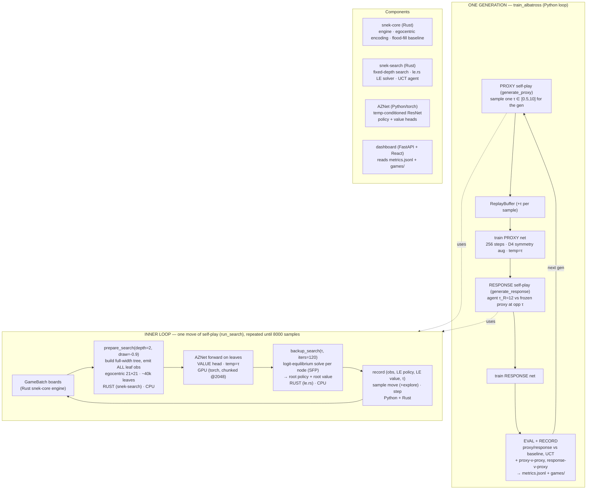

# Albatross training — current architecture

How the live `train_albatross` run actually works (the Python equilibrium path).

## Why the GPU stays busy (and the CPU mostly doesn't)
Each self-play move is **serial**, not pipelined:

`prepare_search` (Rust builds the tree) → **net forward on all leaves (GPU)** → `backup_search` (Rust solves the equilibrium) → step.

The GPU reads ~95% busy because the leaf evaluation is a **huge batch** — the
full-width depth-2 tree across all 256 games on the 21×21 egocentric board is
~40k leaf positions per move, so the GPU forward dominates each move's wall-time.
The Rust parts (tree build + logit-equilibrium solve) are fast enough that the
GPU doesn't idle long between moves. So it's *GPU-dominated work helped by fast
Rust* — **not** a continuous Rust→GPU feeder pipeline (that's the unused
`generate_selfplay_le` fast path). The CPU is still largely idle.

## Diagram

## Notes
- **τ (temperature) is the whole self-play**: proxy plays the logit equilibrium
  at a sampled τ; response best-responds (τ_R) to the frozen proxy at a sampled
  opponent τ. Test-time exploitation = estimate opponent τ by MLE → feed the
  response.
- **baseline / UCT are test opponents only** — used in EVAL and recorded
  replays, never in self-play (Albatross trains purely via self-play; this is
  also "GPU purity"). Training against them would be the optional "league" lever.
- **draw_value = −0.9** in the equilibrium search (was hardcoded 0, which made
  mutual head-to-head death "free" → proxy-vs-proxy suicide-draws).
- **Speed**: bottleneck is the leaf-eval inference volume (full-width depth-2 ×
  21×21 egocentric). The faster future path is the Rust ORT loop
  (`generate_selfplay_le`) with GPU-worker double-buffering — natural fit for a
  cloud H100 to cut iteration time.

See [[albatross-overhaul]] (memory) for the build history and
`docs/albatross-option-matrix.md` for the levers/options.
